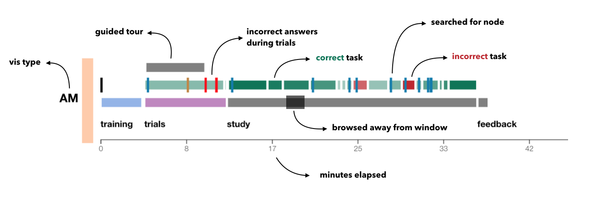

# Survey Data and Analysis Scripts for MVNV Crowdsourced study  

This repository contains all the survey results from the MVNV crowdsourced study as well as the R scripts used to analyze them and the d3 code used to generalize an interactive visualization of the provenance data. 

## Survey Data

The survey data can be found in three formats: JSON for the original data from the firestore database, CSV for exported versions for R processing, and MaxQDA data which contains an export of the qualitative coding done with the survey responses for the open ended explore task. 

## Analysis Code

THe R Scripts used to analyze the results and generate the figures that are included in the paper and in the supplementary pdf can be found in the analysis folder. 

## Provenance Visualization
We created a provenance visualization to see how users interacted with the different techniques in the study. You can access the live version or run the visualization locally on your machine.

### Live version 

A live version of a visualization of the provenance data collected during the survey can be found at [https://mvnv-study.github.io/analysis/](https://mvnv-study.github.io/analysis/). 

### Run locally

In order to see the provenance visualization locally, download this repo and run a local server such as http-server.  

